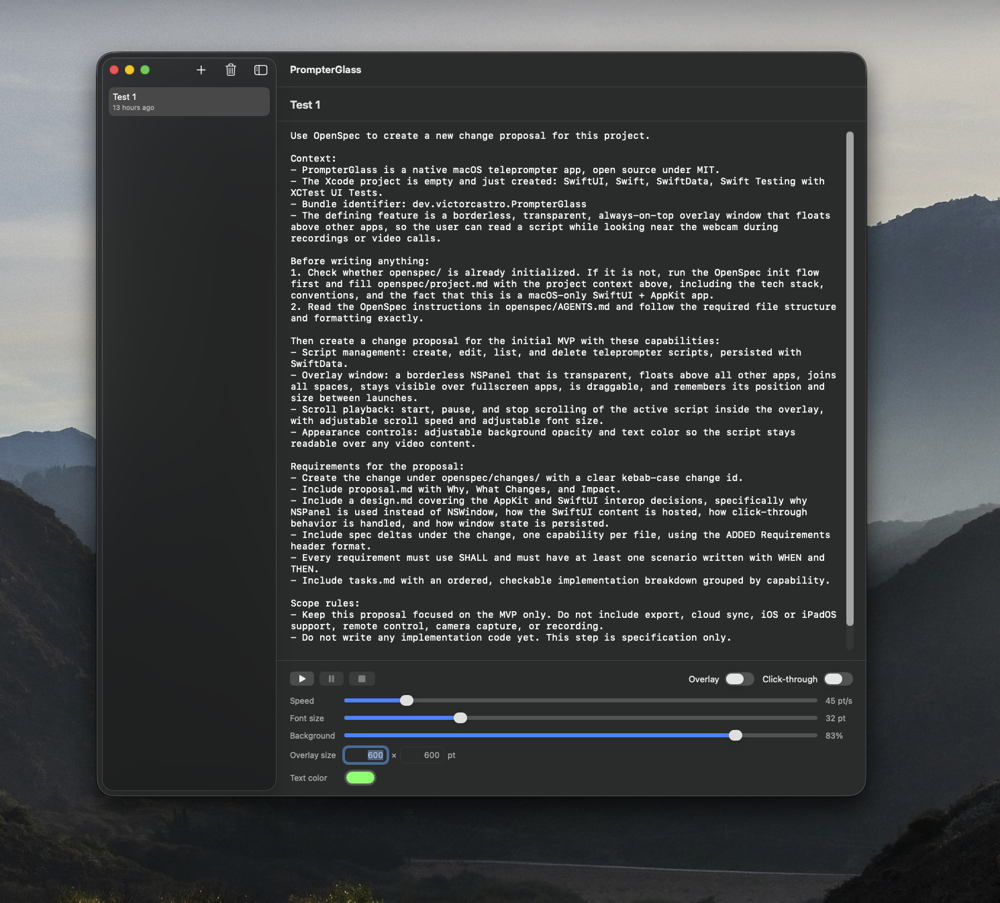
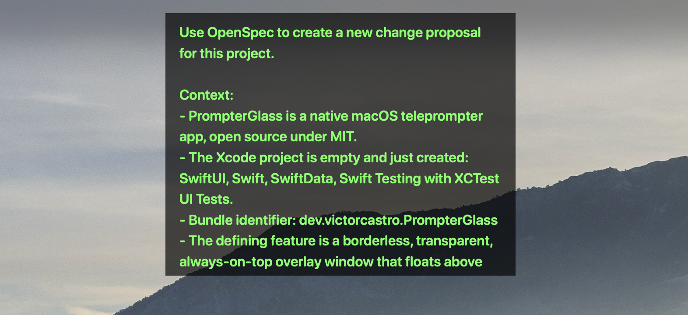

# PrompterGlass

A native macOS teleprompter with a transparent floating window that stays on top of any app — meant for reading your script right next to the webcam during recordings and video calls.

[](LICENSE)


## Screenshots

The main window, where you write your scripts and control playback and appearance:



The floating overlay reading a script over the desktop — transparent, always on top, and readable over anything:



## Project status

**WIP — early development.** The project is just getting started: no release, no installer, no signed binary. The only way to use it today is to build it from source in Xcode. Structure and internal APIs will change without notice.

## Features

- **Script management** — create, edit, list and delete scripts. Stored locally with SwiftData and autosaved as you type.
- **Floating overlay** — a borderless, transparent panel that stays above every other app, shows up on all Spaces, and survives another app going fullscreen. Drag it anywhere by its body; it reopens where you left it.
- **Never steals focus** — clicking or dragging the overlay leaves your recording or call app frontmost and in control of the keyboard.
- **Click-through mode** — make the overlay ignore the mouse entirely so you can work underneath it.
- **Scroll playback** — play, pause, resume and stop, with adjustable speed in points per second. Scrolling is display-linked and frame-rate independent.
- **Readable over anything** — adjustable font size, background opacity and text color. The text stays fully opaque no matter how transparent the background gets.

Everything is controlled from the main window; the overlay itself is chrome-free by design.

## Known limitations

- **Screen sharing captures the overlay.** If you share your whole screen in a call, your script goes with it. Share a single window instead, or keep this in mind before going live.
- **Fullscreen behavior is not uniform.** The overlay stays visible over ordinary fullscreen apps, but some fullscreen games and certain Stage Manager arrangements can still cover it.
- **One overlay, one display.** No multi-overlay or multi-monitor mirroring yet.
- **Plain text only.** No rich text, Markdown or imported documents.

Out of scope for now: export, cloud sync, iOS/iPadOS, remote control, camera capture and recording.

## Requirements

- macOS 26.0 or later (current deployment target)
- Xcode with the macOS 26 SDK
- Swift 5

## Build and run

```bash
git clone https://github.com/VictorCastroDev/PrompterGlass.git
cd PrompterGlass
open PrompterGlass.xcodeproj
```

In Xcode: select the `PrompterGlass` scheme and hit Run (`⌘R`).

## Changelog

See [CHANGELOG.md](CHANGELOG.md).

## Contributing

Open to collaboration. Issues and pull requests are welcome — bug reports, feature ideas, or code. If you plan to tackle something big, open an issue first to discuss the approach.

## License

MIT. See [LICENSE](LICENSE).
